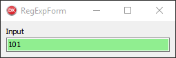
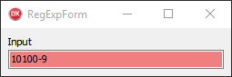

# RegExpValidationSample
Simple application for validation with **^[10]{3,4}([^10]+.\*|[^10]\*)$** regexp
Samples:
* 101 - Valid
* 1010 - Valid
* 10100 - Invalid
* 101-101 - Valid
* 2111 - Invalid

It application writeln by Delphi languade, and used VCL framework.
You can compile this application for Windows(32 or 64).
Or
**Download precompiled exe:** https://raw.githubusercontent.com/AnotherStudent/RegExpValidationSample/master/RegExpValidationSample.exe 

